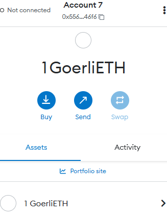
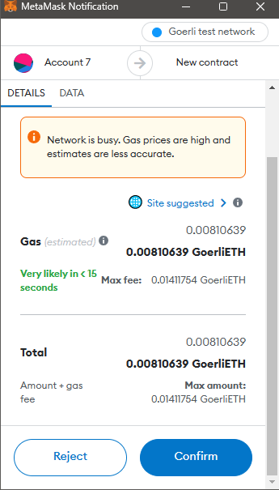

## 1.安装小狐狸插件

## 转账hash
hash: [0x18cb2493c2044d6278facff8756f3266c5ef929df239e6f3f538e969c2eae0a2](https://goerli.etherscan.io/tx/0x18cb2493c2044d6278facff8756f3266c5ef929df239e6f3f538e969c2eae0a2)

## 合约部署
hash: [0x4cc2e01fa5254978295c31924ea4d5b0e7166407283c57fb6e4b1d56638269f4](https://goerli.etherscan.io/tx/0x4cc2e01fa5254978295c31924ea4d5b0e7166407283c57fb6e4b1d56638269f4)

